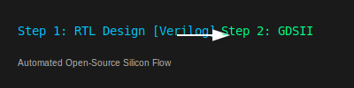

  

  
  
  
  

# Awesome EDA 🛠️ — Open-Source & SaaS Chip Design Resources

> A high-signal curated list of **Electronic Design Automation (EDA)** tools, production-ready flows, and tutorials for 2026.

This repository serves as a comprehensive index for **ASIC, FPGA, and PCB design** in the modern era. Whether you are targeting the **SkyWater 130nm** open PDK, designing a high-speed PCB in **KiCad**, or leveraging **AI-driven SaaS** tools like Flux.ai, this list has you covered.

---

## 🗺️ Visual EDA Flow Index

  

---

## 📑 Contents

- [🚀 Getting Started](#-getting-started)
- [📚 Books](#-books)
- [🎓 Hands-on Tutorials & Example Flows](#-hands-on-tutorials--example-flows)
- [🛠️ Open-Source EDA Tools & Flows](#️-open-source-eda-tools--flows)
  - [📟 PCB & Schematic Design](#-pcb--schematic-design)
  - [📡 HDL Simulation & Verification](#-hdl-simulation--verification)
  - [💎 Logic Synthesis & FPGA Tools](#-logic-synthesis--fpga-tools)
  - [🏗️ ASIC & Physical Design Flows](#️-asic--physical-design-flows)
  - [🔍 Layout Editors & Viewers](#-layout-editors--viewers)
  - [⚡ Analog & Mixed-Signal Tools](#-analog--mixed-signal-tools)
- [☁️ SaaS & Hosted Platforms](#️-saas--hosted-platforms)
- [🧰 Tools & Utilities](#-tools--utilities)
- [🤝 Community & Learning Resources](#-community--learning-resources)
- [📝 Contributing](#-contributing)
- [⚖️ License](#️-license)

## 🚀 Getting Started

- [KiCad Official Tutorials](https://www.kicad.org/help/tutorials/) – Start with PCB design in minutes.
- [OpenLane Quickstart](https://openlane.readthedocs.io/en/latest/docs/source/quickstart.html) – Complete RTL-to-GDSII flow.
- [OpenROAD User Guide](https://openroad.readthedocs.io/) – Foundations of autonomous ASIC design.
- [Yosys Documentation](https://yosyshq.net/yosys/) – Verilog synthesis explained.
- [SkyWater 130nm PDK + OpenLane](https://github.com/google/skywater-pdk) – Free PDK for real tape-outs.
- [eSim Tutorials](https://esim.fossee.in/tutorials) – Integrated circuit + PCB workflow.

## 📚 Books

- [Electronic Design Automation: Synthesis, Verification, and Test](https://www.sciencedirect.com/book/9780123743640/electronic-design-automation) by Lavagno, Markov, Scheffer – The definitive EDA reference.
- [Essential Electronic Design Automation (EDA)](https://www.amazon.com/Essential-Electronic-Design-Automation-EDA/dp/0131828290) by Mark D. Birnbaum – Easy-to-understand overview.
- [CMOS VLSI Design: A Circuits and Systems Perspective](https://www.amazon.com/CMOS-VLSI-Design-Circuits-Perspective/dp/0321547748) by Weste & Harris – Classic VLSI bible.
- [Digital Integrated Circuits: A Design Perspective](https://www.amazon.com/Digital-Integrated-Circuits-Design-Perspective/dp/0130909963) by Rabaey – RTL to silicon.

## 🎓 Hands-on Tutorials & Example Flows

- [Tiny Tapeout](https://tinytapeout.com/) – Submit your design and get it fabricated on real silicon.
- [OpenLane Example Designs](https://github.com/The-OpenROAD-Project/OpenLane/tree/master/designs) – Ready-to-run examples.
- [OpenROAD Flow Tutorials](https://github.com/The-OpenROAD-Project/OpenROAD-flow-scripts) – Complete end-to-end flows.
- [Yosys + nextpnr FPGA Workshop](https://github.com/YosysHQ/nextpnr) – Hands-on FPGA logic synthesis.
- [KiCad + ngspice Simulation Labs](https://forum.kicad.info/) – Community projects.

## 🛠️ Open-Source EDA Tools & Flows

---

### 📟 PCB & Schematic Design

| Tool | Description | Year | Commercial Alternative | Key Deficiency |
|---|---|---|---|---|
| [KiCad](https://www.kicad.org) | 🛠️ Professional-grade schematic & PCB layout. | — | Altium Designer | Lacks complex length matching and native back-drilled via support. |
| [LibrePCB](https://librepcb.org) | 🌿 Modern suite with excellent library management. | — | Autodesk Eagle | Lacks hierarchical sheets and mature vendor library ecosystem. |
| [eSim](https://github.com/FOSSEE/eSim) | 🎓 Full-stack circuit design, simulation, and PCB. | — | Altium Designer | Wrapper-based; lacks unified environment for rigid-flex designs. |

---

### 📡 HDL Simulation & Verification

| Tool | Description | Year | Commercial Alternative | Key Deficiency |
|---|---|---|---|---|
| [Verilator](https://github.com/verilator/verilator) | 🚀 Fastest Verilog/SystemVerilog simulator. | — | Synopsys VCS | 2-state cycle-accurate only; lacks native 4-state (X/Z) support. |
| [Icarus Verilog](https://github.com/steveicarus/iverilog) | 💡 Lightweight Verilog simulator & synthesizer. | — | Siemens Questa | Limited SV support for OOP and complex assertions (SVA). |
| [GHDL](https://github.com/ghdl/ghdl) | 🔗 VHDL simulator with excellent IEEE support. | — | Siemens Questa | VHDL-only; lacks multi-language (SV/SystemC) integration. |
| [sv2v](https://github.com/zachjs/sv2v) | 🔄 SystemVerilog to Verilog translator. | 2019 | — | Niche utility; limited by downstream tool features. |

---

### 💎 Logic Synthesis & FPGA Tools

| Tool | Description | Year | Commercial Alternative | Key Deficiency |
|---|---|---|---|---|
| [Yosys](https://github.com/YosysHQ/yosys) | 🔧 Extensible Verilog RTL synthesis suite. | 2012 | Synopsys DC | Lacks topographical awareness and advanced power-aware synthesis. |
| [Berkeley-ABC](https://github.com/berkeley-abc/abc) | 📐 Logic synthesis and verification system. | 2005 | Synopsys DC | Primarily a logic optimizer; lacks industrial timing-driven mapping. |
| [nextpnr](https://github.com/YosysHQ/nextpnr) | 🗺️ FPGA place-and-route (Lattice, ECP5, etc.). | — | Xilinx Vivado | Lacks deep device optimizations for high-utilization designs. |
| [VTR](https://github.com/verilog-to-routing/vtr-verilog-to-routing) | 🏫 Academic FPGA CAD flow. | 2012 | — | Performance often trails vendor-specific tools. |

---

### 🏗️ ASIC & Physical Design Flows

| Tool | Description | Year | Commercial Alternative | Key Deficiency |
|---|---|---|---|---|
| [OpenROAD](https://github.com/The-OpenROAD-Project/OpenROAD) | 🤖 Autonomous RTL-to-GDSII flow. | — | Cadence Innovus | ~2.1x area penalty; lacks manual congestion "knobs". |
| [OpenLane](https://github.com/The-OpenROAD-Project/OpenLane) | 🏗️ Automated ASIC flow (real tape-outs). | — | Cadence Innovus | Rigid; difficult to customize for non-standard cells. |
| [OpenSTA](https://github.com/The-OpenROAD-Project/OpenSTA) | ⏱️ Static timing analysis engine. | 2018 | Synopsys PrimeTime | Lacks Signal Integrity (SI) and variation-aware modeling. |

---

### 🔍 Layout Editors & Viewers

| Tool | Description | Year | Commercial Alternative | Key Deficiency |
|---|---|---|---|---|
| [Magic VLSI](https://github.com/libresilicon/magic-8.22017) | 🏛️ Venerable interactive layout editor. | 2017 | Cadence Virtuoso | Lacks Schematic Driven Layout (SDL) and FinFET extraction. |
| [KLayout](https://github.com/KLayout/klayout) |  telescope Powerful GDS/OASIS viewer and editor. | 2017 | Cadence Virtuoso | Lacks integrated PDK management and real-time SDL probing. |

---

### ⚡ Analog & Mixed-Signal Tools

| Tool | Description | Year | Commercial Alternative | Key Deficiency |
|---|---|---|---|---|
| [ngspice](https://github.com/imr/ngspice) | 📈 SPICE circuit simulator (industry-grade). | 1999 | Cadence Spectre | Lacks native Verilog-A support and certified model implementations. |
| [Xschem](https://github.com/stefanschippers/xschem) | 📝 Schematic capture for analog/mixed-signal. | — | Cadence Virtuoso | Lacks unified Library Manager and design management infrastructure. |
| [ALIGN](https://github.com/ALIGN-analoglayout/ALIGN-public) | 🤖 Automated analog layout synthesis. | 2018 | Virtuoso Layout XL | Cannot yet replicate manual "expert tricks" of human designers. |

---

## ☁️ SaaS & Hosted Platforms

| Product | Description | Pricing | Free Tier Limit | Major Clients |
|---|---|---|---|---|
| [Flux.ai](https://www.flux.ai) | 🤖 AI-driven browser-based PCB design. | $20/mo | 14-day trial | Luxonis, Geocene |
| [Synopsys Cloud](https://www.synopsys.com/cloud.html) | ☁️ Flagship IC tools (pay-as-you-go). | Per-minute | Free reference designs | NVIDIA, Intel, AMD |
| [Cadence OnCloud](https://www.cadence.com/en_US/home/solutions/oncloud.html) | 🛍️ On-demand simulation marketplace. | Token-based | 8-hour free trial | Apple, NVIDIA, Samsung |
| [JITX](https://www.jitx.com) | 🐍 Python-based hardware automation. | Sales-led | Free for public designs | Lockheed Martin |

---

## 🧰 Tools & Utilities

| Tool | Description | Year |
|---|---|---|
| [SkyWater 130nm PDK](https://github.com/google/skywater-pdk) | 🛠️ Free manufacturable PDK. | — |
| [Open_PDKs](https://github.com/RTimothyEdwards/open_pdks) | ⚙️ Open PDK setup tools. | — |
| [Netgen](https://github.com/RTimothyEdwards/netgen) | 🧬 LVS (Layout vs Schematic). | — |

---

## 🧪 Experimental & Research

| Tool | Primary Area | Description |
|---|---|---|---|
| [PyMTL](https://github.com/cornell-brg/pymtl) | 🐍 Hardware Modeling | Python-based hardware modeling framework. |
| [OpenPiton](https://github.com/PrincetonUniversity/openpiton) | 🏰 Research SoC | Manycore open research processor platform. |
| [PRGA](https://github.com/PrincetonUniversity/prga) | 💎 FPGA Workflow | Research FPGA architecture exploration workflow. |

---

## 🤝 Community & Learning Resources

- [EDAboard](https://www.edaboard.com) – 💬 Largest international EDA discussion forum.
- [r/VLSI](https://www.reddit.com/r/VLSI/), [r/FPGA](https://www.reddit.com/r/FPGA/), [r/chipdesign](https://www.reddit.com/r/chipdesign/).
- [KiCad Discord](https://discord.com/invite/FANuKv8sZn) – 🎧 Official community.
- [VLSIGuru](https://vlsiguru.com) – 🎓 Training resources.

## 📝 Contributing

Contributions are **highly welcome**! Ensure tools are **actively maintained** and provide a clear one-sentence description.

## ✨ Star History

